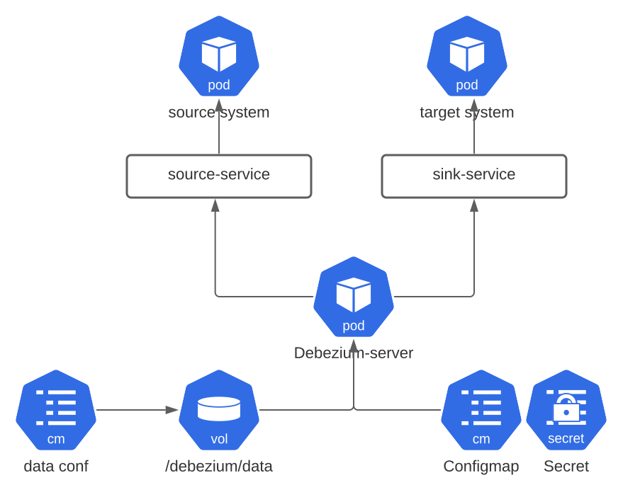

# Debezium Server Operator
A kubernetes operator for easy deployment and management of a Debezium Server installation.

#####Overview
The operator deploys a user desired version of the Debezium server application in k8s and manages the deployment. 
The operator does this by watching the Kubernetes apiserver  for changes to DebeziumServer custom resources and the deployment created for the server application. The custom resource provides custom fields that users can use to specify the desired number of instances of the server they want to run, together with a source system and a  target message broker they want to use.

The following resources must be created beforehand:
- *Source Deployment*: Create a Deployment for the source system (e.g a version of MySQL server)
- *Source Service*: Expose the source deployment through a Service. We call this service the `source service` and it is the interface 
over which the server communicates with the source system to capture change event records.
- *Target Deployment*: A deployment for the target message broker.
- *Sink Service*: Expose the target deployment through a Service. We call this service the `sink service` and is the interface through the server communicates with the target message broker to forward captured changes events.
- *Server ConfigMap*: A ConfigMap object containing all the non-sensitive configuration options needed by the server.
- *Server Secret*: A Secret object containing all the sensitive (e.g usernames and passwords) configuration options
needed by the server.

The diagram below is a higher level view of the k8s resources comprising the server deployment.



The current (prototype) implementation of the operator does not create nor manages the resources for the source system and target message broker and requires users to first create those resources. Those resources can be provisioned manually or using another k8s operator (e.g using strimzi to install/manage Kafka as target message broker). Therefore, the operator does not know anything about deployments for the source and target message broker. The only requirement is that users must provide the services over which the source and target systems can be accessed by the server. 
The operator also requires all resources to exist in the same namespace as the custom resource object. This is a current limitation of this prototype and will be addressed in subsequent commits.

##### TODO:
- Currently, only a single deployment of Debezium server is allowed.
- Operator should watch changes to the server ConfigMap and Secret objects and restart the pod running the server to pick up the changes
- Operator should watch changes to source and sink services

##### Demo
We will walk through a sample demo of the operator were we use *MySQL* as source system and *Apache Kafka* as target message broker. For the source system, we will create a deployment and expose it through a headless service. For Apache Kafka, we will create a deployment and service for both Kafka and Zookeeper. All deployments in this demo will contain a single replica pod.

The demo assumes that you have a k8s cluster running and the kubectl CLI is configured to communicate with the k8s API.
We prepared all the manifest files needed for the demo and they are available in the *k8s* folder.

##### Prerequisite
Before we proceed, we first need to create the *CustomResourceDefinition* for our new kind in the cluster and then install the operator in the cluster. Installing the operator first requires building the operator source code and a Docker image that we then push to Docker Hub.

##### Build Docker Image
```shell
mvn clean package
```

##### Install CRD
```shell
kubectl apply -f k8s/crd.yaml
```

You can optionally push the image to Docker Hub or make it available to Minikube's docker host.

##### Install Operator
```shell
kubectl apply -f k8s/operator.yaml
```

##### Create MySQL deployment and headless Service:

``` shell
kubectl apply -f k8s/mysql.yaml
```
Verify that a Deployment, Service and Secret is created for the source system

```shell
kubectl get deployment,svc,secret
```

##### Create a Deployment and Service for Zookeeper. 
The pod running the Kafka workload will connect to Zookeeper using the zookeeper service

```shell
kubectl apply -f k8s/zookeeper.yaml
```

##### Create a Deployment and Service for Apache Kafka.
The server application will use this Service to connect to the Kafka message broker

```shell
kubectl apply -f k8s/kafka.yaml
```

##### Create Server Config Options:

```shell
kubectl apply -f k8s/server-config.yaml
```

The `server-config.yaml` contains both a ConfigMap and Secret definition. The ConfigMap defines non-sensitive configuration options while the Secret defines sensitive configuration options (e.g the username/password that the source connector uses to connect to the MySQL source system).

##### Create the custom resource:

```yaml
apiVersion: debezium.io/v1
kind: DebeziumServer
metadata:
  name: server-cr
spec:
  replicas: 1
  version: 1.6
  config:
    configMapName: server-configmap
    secretName: server-secret
  sourceSystem:
    # The name and port of the service use to access the source system
    # The Service been referenced here must exist in the same namespace as this custom resource
    service: 
      name: mysql-service
      port: 3306
  targetSystem:
      service:
        name: kafka-service
        port: 9092
```

The manifest above instructs the operator to deploy version 1.6 of the Debezium Server and configure it to use the configuration options specified in the `.spec.config` custom field. The operator injects the specified configuration options into the server's environment variables.
The `.spec.sourceSystem` and `.spec.targetSystem` fields configures the service that the server should use to communicate with the source system and the target message broker.

##### Check that the server is deployed and ready
```shell
kubectl get dbs
```

The status READY field should show that 1 instance of the server is ready and running.

If you list the running deployments and pods, you will see that the operator created a single replica pod, which is managed using a deployment.

```shell
kubectl get deploy,pods
```

##### Viewing change events
At this point, you can create a MySQL client that connects to the `source-service` to insert some records into the MySQL database and watch how the server
forwards the changes to Kafka. To see the changes injested into Kafka, you can start a pod running. You can use the `watch-topic` utitility used in the Debezium tutorial website to view the changes forwaded to Kafka. 

##### Delete custom resource
Finally, deleting the custom resource will delete the deployment that it created

```shell
kubectl delete dbs server-cr
```

This time around, listing the deployments will not show the debezium server deployment (and pod)

```shell
kubectl get deploy,pods
```
